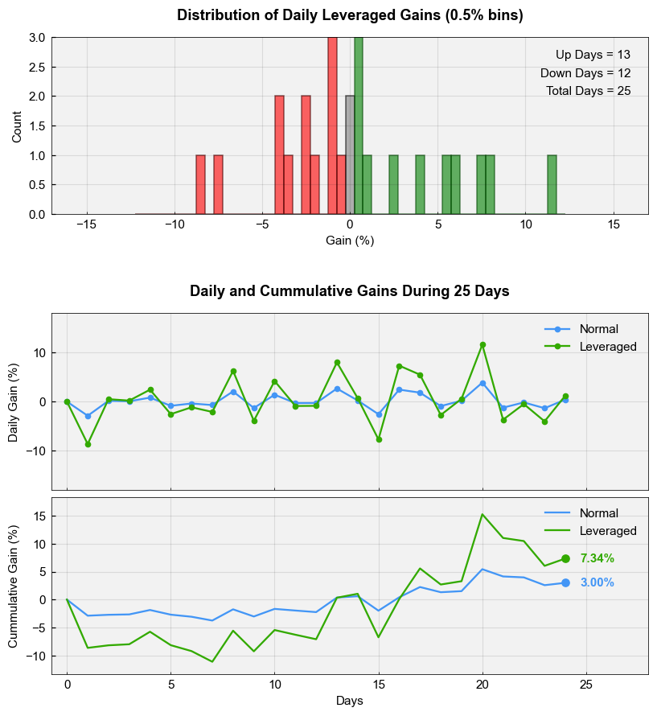
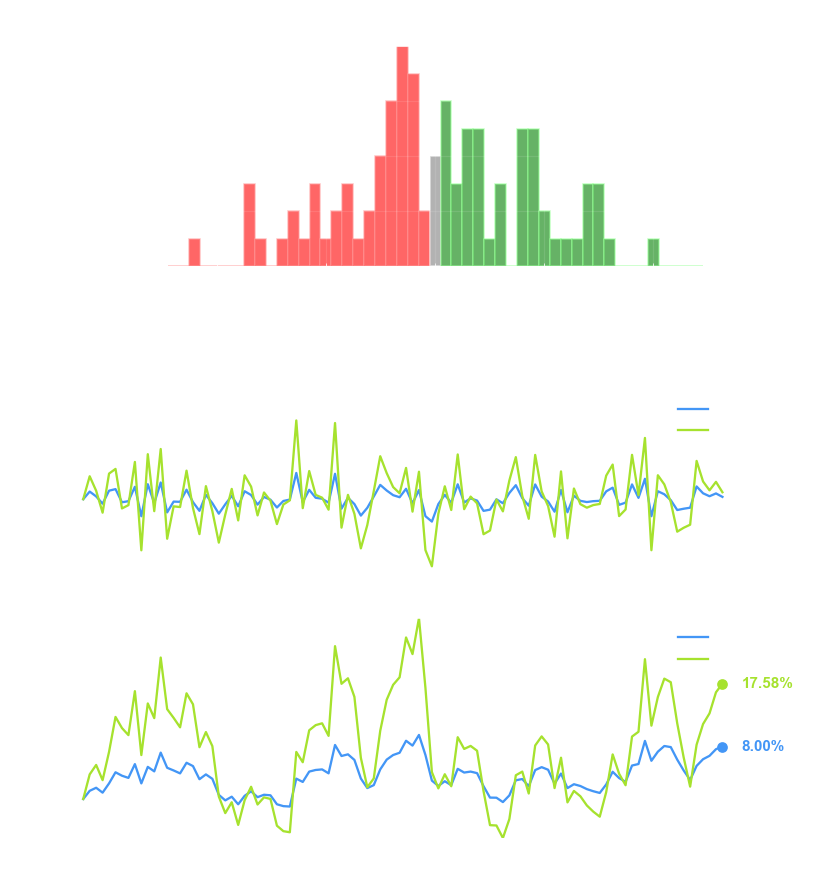

# Normal vs Leveraged Gains

The notion that leveraged gain is a decaying return can be a concern to many investors. It is a conventional wisdom that leveraged ETF is not meant for a long-term buy-and-hold strategy. However, most illustrative examples only touch on a one-day gain follow by a one-day loss, resulting in net loss that shows that leveraged ETF results in a bigger loss.

For example,

```
      Normal - Gain (10%): $100 * 0.9 -> $90   Loss (10%): $90 * 1.1 -> $99
3x Leveraged - Gain (30%): $100 * 0.7 -> $70   Loss (30%): $70 * 1.3 -> $91
```
where 3x-leveraged investment result in a bigger loss.

Another (counter) example,
```
      Normal - Gain (10%): $100 * 0.9 -> $90   Loss (20%): $90 * 1.2 -> $108
3x Leveraged - Gain (30%): $100 * 0.7 -> $70   Loss (60%): $70 * 1.6 -> $112
```
which results in a gain. 

### Q: So how should one really think about this?

The first example has a compound gain of 0.9 x 1.1 = 0.99 (less than one) while the second example has a compound gain of 0.9 x 1.2 = 1.08 (more than one, quite significantly). One should question what happens when there is a healthy overall gain during that investment period? After all, a good ETF should have a collection of assets that produces a net gain.

The notebook `gain.ipynb` provides a simluation to examine various scenarios.

# Example Output




